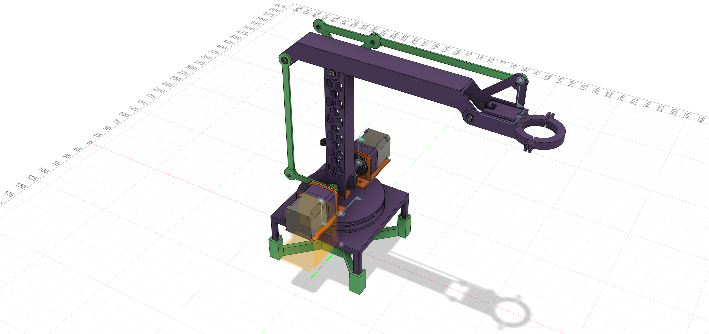

# 3DOF-Robotic-Arm-3DParts

RRR 构型 3 自由度机械臂模型

小臂使用连杆驱动降低大臂电机负载

末端使用平行连杆保持水平

关节连接使用轴肩螺丝结合轴承固定

## 文件说明

本目录包含机械臂的完整 3D 模型文件，每个文件均提供 `Fusion360` 格式（`.f3d`）和 `STEP` 通用格式（`.step`）两个版本：

- **ALL** - 包含所有打印件及电机模型的完整装配体
- **Print** - 所有打印件的合集
- **Green** - 绿色打印件组件
- **Orange** - 橙色打印件组件
- **Purple** - 紫色打印件组件